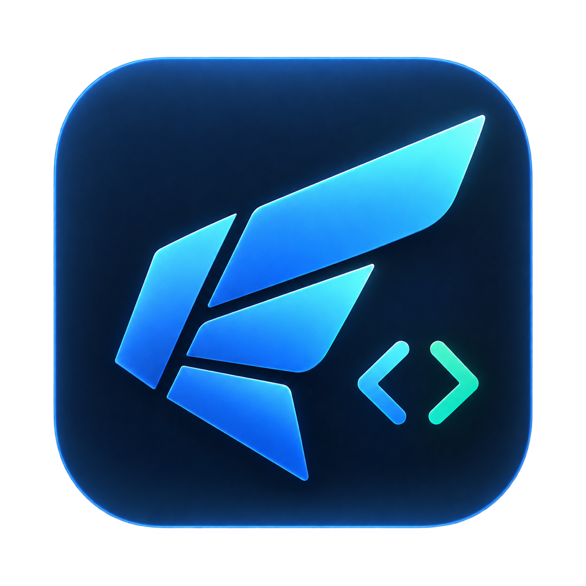

<h1 align="center">
  
  <br>Daedalus
</h1>

<p align="center">
  A macOS app and CLI for running coding agents, organized by workspace and task.
  <br>
  <a href="#installation">Installation</a>
  ·
  <a href="#quick-start">Quick start</a>
  ·
  <a href="#documentation">Documentation</a>
  ·
  <a href="DEVELOPING.md">Developing</a>
</p>

<p align="center">
  <a href="https://github.com/Bakar0/daedalus/releases/latest"></a>
  <a href="https://github.com/Bakar0/daedalus/actions/workflows/ci.yml"></a>
  
</p>

## Highlights

- Runs Claude Code and Codex side by side, each session in its own Git worktree.
- Sessions live in tmux, so quitting or updating the app never interrupts an agent.
- A board of tasks per workspace, with a brief and a journal agents read and write.
- `daedal`, a CLI that does everything the app does, from any terminal or agent.
- Self-contained: the app bundles its own Bun and tmux, and updates itself.

## Installation

Requires macOS 14 or newer and `git`.

```sh
brew install --cask bakar0/tap/daedalus
```

This installs the app and puts the `daedal` command on your PATH. Open Daedalus from Applications once to finish setting it up, then install and sign in to the agent CLIs you want to use, such as [Claude Code](https://docs.anthropic.com/en/docs/claude-code) or [Codex](https://github.com/openai/codex).

Verify the install:

```console
$ daedal doctor
✓ bun: 1.3.13
  runtime bundled with Daedalus.app
✓ tmux: tmux 3.7c
  /Applications/Daedalus.app/Contents/MacOS/tmux (verified minimum 3.7c)
✓ home: /Users/you/.daedalus
✓ database: /Users/you/.daedalus/state.db
```

Every line should start with ✓, and the command exits with status 0. A ✗ line names what is missing.

## Quick start

```sh
daedal workspace create "My project"
daedal task create --workspace my-project --title "Implement feature"
daedal agent spawn --workspace my-project --provider claude
daedal agent list --running
```

The same workspace, task and session appear in the app as they are created. Run `daedal --help` for every command.

## Documentation

| Guide                                          | Covers                                                     |
| ---------------------------------------------- | ---------------------------------------------------------- |
| [Desktop](docs/desktop.md)                     | the board, sessions, terminals, notifications and quitting |
| [CLI](docs/cli.md)                             | every `daedal` command                                     |
| [Workspace content](docs/workspace-content.md) | workspaces, the repository library and worktrees           |
| [Skills](docs/skills.md)                       | the agent skills Daedalus installs                         |
| [Architecture](docs/architecture.md)           | package boundaries, persistence, sessions and terminals    |
| [Releasing](docs/releasing.md)                 | releases, updates, signing and the Homebrew cask           |

## Developing

Building from source, running the tests and cutting a release are covered in [DEVELOPING.md](DEVELOPING.md).
